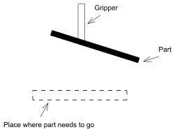
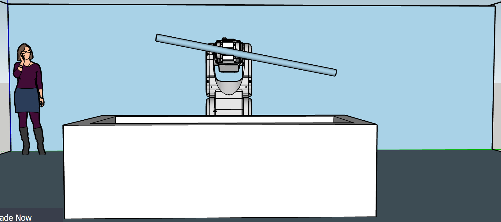
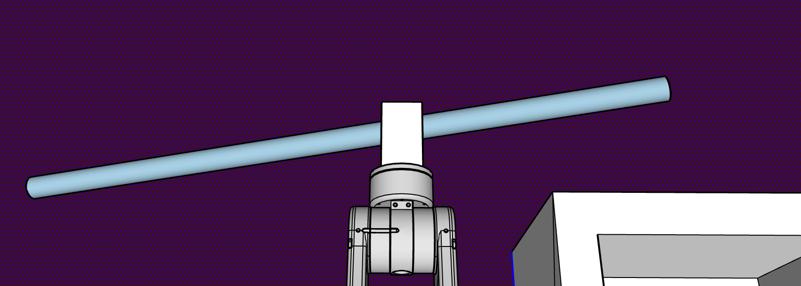
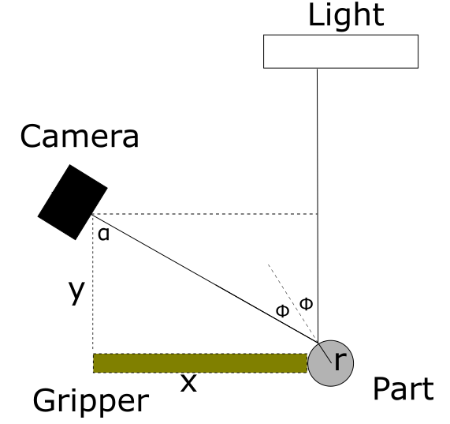
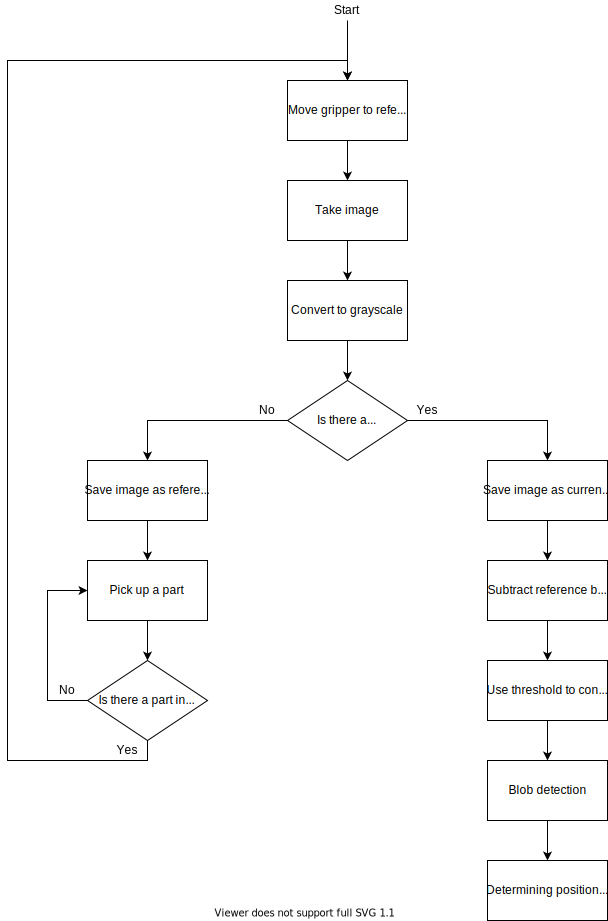

# Detection of the picked-up part with respect to the gripper

## Author
Klaas Vanderlinden

## Introduction
After the part is picked up, the next step is to place it where it is intended to go. This is not a trivial task since the position and pose of the part w.r.t. the gripper is not certain.



What follows is an attempt at determining these properties.

## Method

### Description
This method proposes a camera-based approach. A camera would be placed at the base of the robot arm with the part and gripper in its field of vision. 


To easily detect the gripper, one or more programmable LED lights could be used as a robust reference. These could be detected by the skill proposed by Jens and Glenn. (https://gitlab.kuleuven.be/rob-ecs/2020/arcs2020/-/tree/master/report_1/DotAndDistanceDetection).

The next step is to detect the part the gripper is holding. Here, contour detection is proposed because I believe it will be the least computation heavy.

### Contour detection
Contour detection could work great if the background image is relatively still and constant. The method would work like this. Before we pick up a part, we take an image of the background (so also without the arm) and use this as a reference. Then when trying to detect the part, we subtract the reference image from the current image. If the background didn't change, we obtain the difference which would be the arm and the part. Assuming we know the shape of the arm, we can deduce the shape of the part and where it is connected to the gripper. (https://en.wikipedia.org/wiki/Foreground_detection)

#### Conditioning

If we assume we work with a camera with an angle of view of 84° (https://coral.ai/docs/camera/datasheet/) and that the bars are 2m long (all magic numers), we need the camera to be at a distance of at least 1.5m (Pythagoras) to be able to capture the full bar. To account for the situation that the bar is not right in the middle of the picture, we take this distance to be at least 2m. 

This can be done in two ways. First, look from the side. This can be done easily but it requires the robot to be against a still background. This method requires a lot of space in the horizontal direction. 



Therefore, I propose a other method, which positions the camera above the robot. From here it can look down on the part, which ensures a still background as the floor is not likely to change. The lights on the ceiling shine directly down on the part. By positioning the part in such a way that the metal surface causes a glare in the camera, it will be easily recognizable against the floor, which can be made black for contrast.



The glare is achieved by getting the light to reflect from the ceiling lights onto the metal into the lens. Since the angle of reflection is the same angle of incidence, we can work out where we need to hold the piece.



In this image, we assume that y and α are known. The goal is then to find x, i.e. how far out the gripper must be. Using trigonometry, we can find two important relationships.

```math
\tan{2\phi} = \frac{x+r-r\sin{\phi}}{y-r\cos{\phi}} \\
\alpha = 2\phi
```

Combining these equations results in a formula for x

```math

x = \tan{\alpha}(y-r\cos{\frac{\alpha}{2}})-r(1-\sin{\frac{\alpha}{2}})
```


This should be sufficient to garantee that the part is succesfully recognized.


#### Algorithm
The algorithm consists of the following parts.
1) Take a picture of the view of the camera with the arm in a reference position and save this as your reference background in grayscale.
2) After picking up a part, move the arm to its reference position and take another picture and save it as the current situation in grayscale.
3) Subtract the reference background image from the current situation image.
4) Convert the remaining image into black and white using a threshold.
5) Use blob detection to identify the object by its size. (Large=bar, small=connector piece) (https://en.wikipedia.org/wiki/Blob_detection)
6) Determine the position of the blob in relation to the gripper.

I will discuss step 5 and 6 below. 



### Discussion of step 5 and 6
Most of the 'skill' lays in step 5 and step 6. 

First, the blob detection could work like this.
1) Scan image from left to right and top to bottom.
2) For every pixel check its neighbor pixel.
3) Create a blob vector for each blob.
4) Check the size of blob and put value in to blob vector.
5) Check the two blob are mergable or not if mergable then put it in to single blobvector.
6) Draw rectangle for each blob.
For more info, see https://www.ijert.org/research/an-abandoned-object-detection-system-using-background-segmentation-IJERTV3IS11097.pdf

Second, the determination of the position of the part w.r.t. the gripper should be simple since the gripper is always in the same place in the image.
We can thus determine the position of the part w.r.t. the gripper by looking at the position of the blob on the image.


