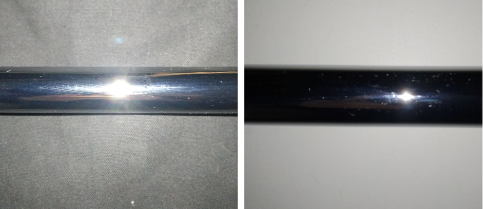

# Perception skill: Detection of the position of the object w.r.t. the gripper

## Author
Klaas Vanderlinden

## Introduction

After an object is picked up by the gripper, the next step is to place it where it is intended to go. This is not a trivial task since the position of the object w.r.t. the gripper is not certain. Therefore, a 'skill' is required to determine this. The input of this skill will be pictures taken by a camera and the output will be coordinates of a box surrounding the object. These coordinates are expressed in a field where the gripper is the origin.

### Setup

The setup requires a camera which is pointed at a still, and if possible uniform, background. Candidates for this background are the floor, the ceiling or a part of the robot itself. Shadows on the object (e.g. due to the robot arm moving in front of the light source) are to be avoided.

A little testing reveiled that for metal bars, a white background is favourable as the object is more distinguised, although the black background is definitely also usable.

Active lighting is also proposed which shines on the object from the same direction as the camera is looking. This maximizes the contrast between the object and the background. 

The idea of using glare is not used here as it requires diffuse lighting which is more difficult to obtain and more expensive, although it would be an interesting approach.

### Method

By moving the object across the field of vision of the camera and tracking how long it takes from the beginning of the object to the gripper and from the gripper to the end of the object, the position of the object w.r.t. the gripper is determined.

## Perception stack

### Pre-processing

The pre-processing in this skill consists of converting the image to grayscale in order to ease the computations.

### Pre-processing data <-> Sensor feature

The sensor feature is the detection of (part of) the object in the image. This is done by contour detection which consists of the following steps.

1) Take a picture of the view of the camera and save this as your reference background in grayscale.
2) After picking up a part, move the arm through the field of vision of the camera and take another picture and save it as the current situation in grayscale.
3) Subtract the reference background image from the current situation image.
4) Convert the remaining image into black and white using a threshold.
5) Use blob detection to identify what is part of the object and what is noise (https://en.wikipedia.org/wiki/Blob_detection)

Magic numbers that come into play here are the threshold value and the required blob size. These will be determined by calibration.

### Sensor feature <-> Object sensor feature

The object sensor feature is the tracking over time of the blob detection. For an arbitrary interval we can combine the blob detection of every 'frame' in that interval with the knowledge about the movement of the arm. This results in the determination of the size of the part that passed through the field of vision in that interval.

### Object sensor feature <-> Object feature

The object feature is the determination of the position of the part in relation to the position of the gripper. With the knowlegde about how long the shape is before the gripper passes and how long the shape is after the gripper passes through the field of vision, it is possible to determine the position of the gripper in relation to the whole part.

