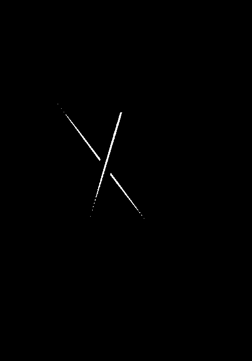
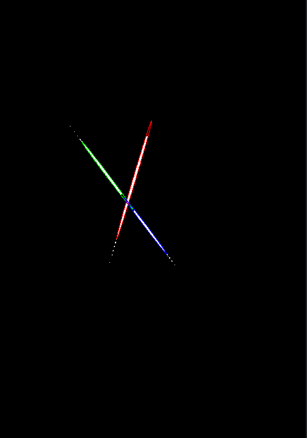
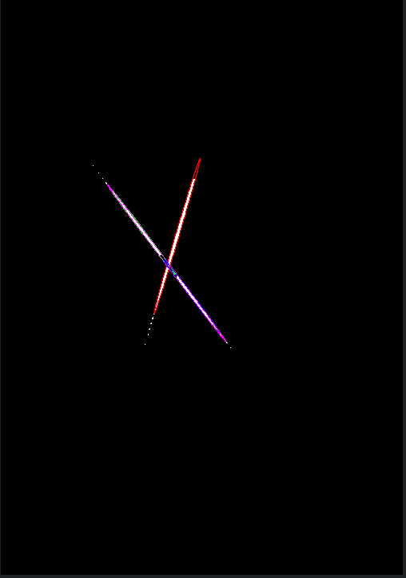
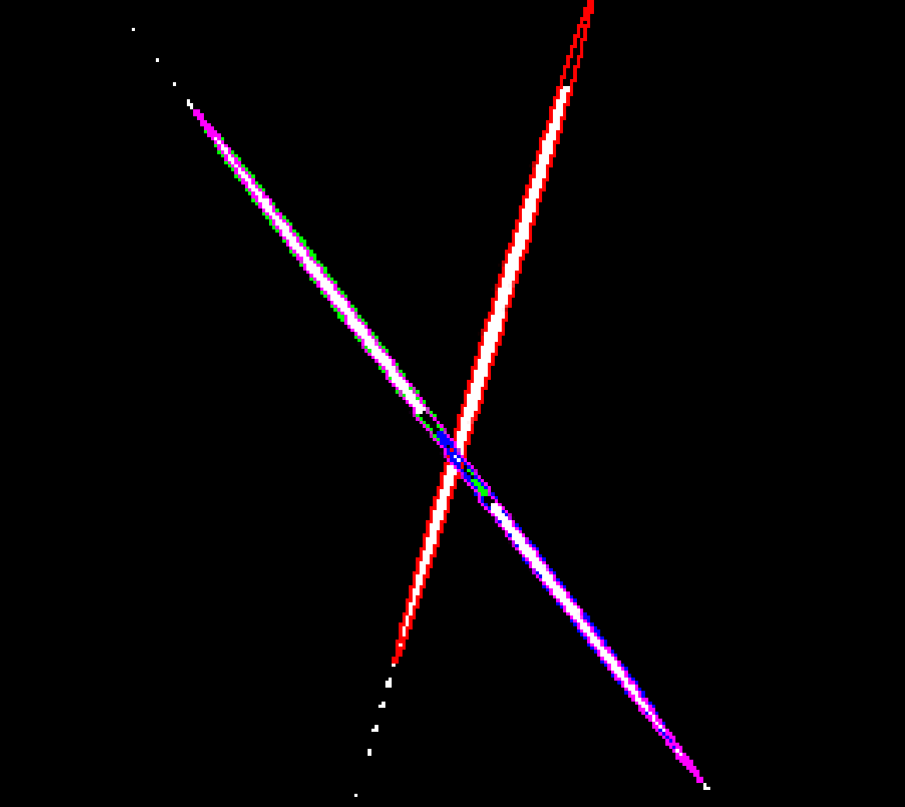
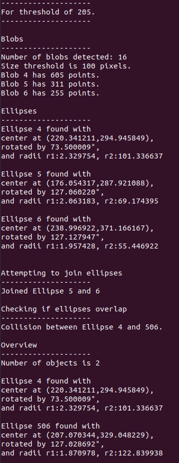
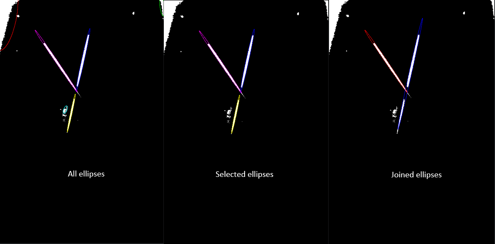
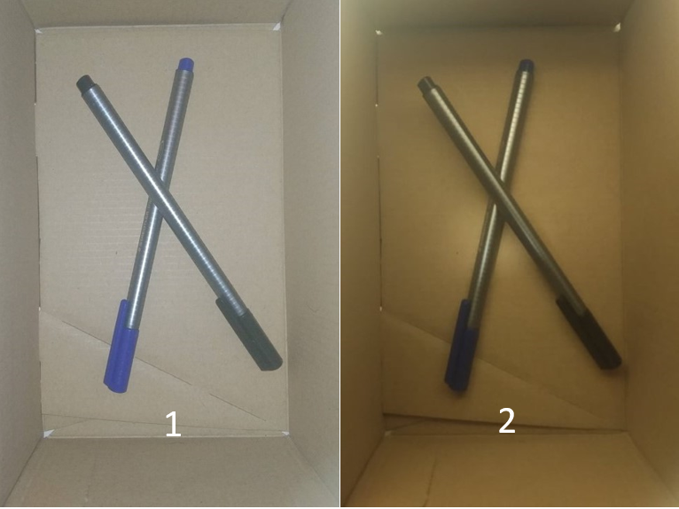
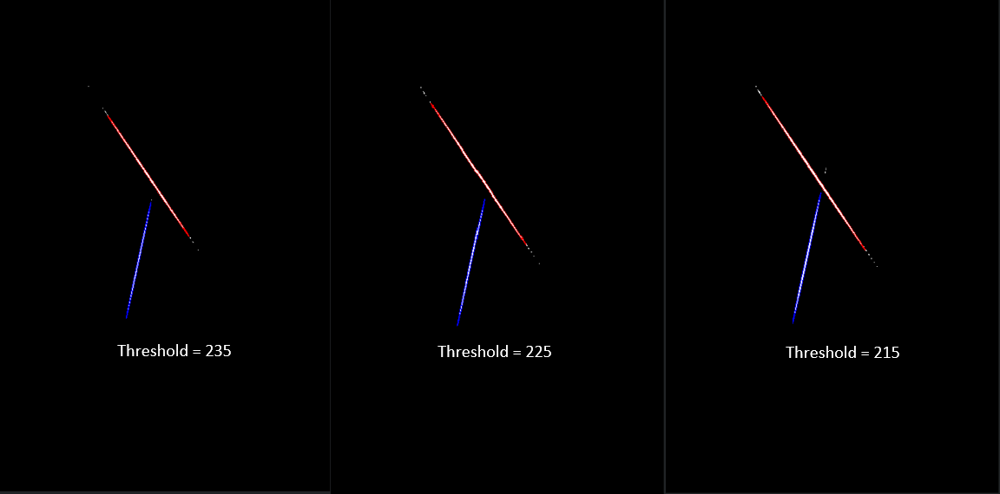
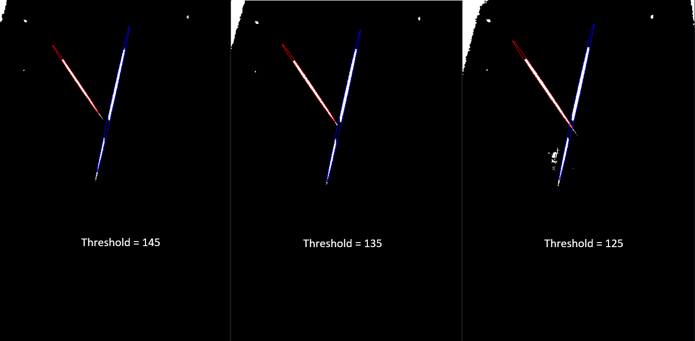

# Report IV
```
Klaas Vanderlinden
```
## Previous reports
* [Report II](https://gitlab.kuleuven.be/rob-ecs/2020/arcs2020/-/blob/master/report_2/software/Arm-SW-perception/Glare_detection/Report_II.md)
* [Report III](https://gitlab.kuleuven.be/rob-ecs/2020/arcs2020/-/blob/master/report_3/Glare_detection_TRL/Report_III.md)
## Summary of Report IV
* added ability to join ellipses belonging to same object
* added ability to detect collision between ellipses
* added ability to select desired shapes
* added ability to track ellipses between thresholds
* added ability to dynamically choose "magic number" threshold
* added ability to check for saturation

## 1. Introduction
This report is an extension of Report II about a object detecting method using glare. In the previous report, the algorithm was able to differentiate different shapes and fit an ellipse around them. This report continues that work and defines what happens after an ellipse is fitted. The focus is the association relations between _multiple_ candidate shapes where in the previous report the focus was on the association relations for _individual_ candidate shapes.  


## 2. Join ellipses belonging to same object

This was already discussed in Report III [here](https://gitlab.kuleuven.be/rob-ecs/2020/arcs2020/-/blob/master/report_3/Glare_detection_TRL/Report_III.md#connect-two-or-more-blobs-if-they-belong-to-the-same-tube). 

This is implemented in the code in the function 
```c
void joinellipses(Ellipse* ellipses, size_t* ptrlength)
```
It checks every combination of two ellipses for the following conditions
```math
\theta_{1} = \theta_{2}
```
```math
\theta_{1} = \frac{y_{c2}-y_{c1}}{x_{c2}-x_{c1}}
```   
```math
AR_{1} = AR_{2} 
```

The first condition checks if two ellipses lay in the same direction i.e. are parallel.
The second condition checks if the line between the two centers lays in the same direction as the two ellipses.
The third condition checks if the aspect ratios of the two ellipses are equal.

All these conditions allow a certain marge because of numerical rounding in the fitting of the ellipse in the MVEE function.

### Example
In the case of this image, the algorithm detects 3 ellipses.
<figure float="left">

<figcaption>_Figure: Thresholded image_</figcaption>
</figure>
<figure float="left">

<figcaption>_Figure: Detected ellipses_</figcaption>
</figure>

It is clear that the green and blue ellipses belong to the same object. The algorithm detects this and fits a new ellipse.

<figure float="left">

<figcaption>_Figure: Joined ellipses_</figcaption>
</figure>

<figure float="left">

<figcaption>_Figure: Joined ellipses zoomed in_</figcaption>
</figure>

The purple ellipse clearly fits around the points of the blue and green ellipse.

## 3. Detect collision
A subject related to joining ellipses is detection of collisions between ellipses. In general, when we need to join two ellipses, it means that one object is on top of the other, which causes two seperate blobs. 

This functionality is contained in the function
```c
void overlap(EllipseCollideTest* test, Ellipse* ellipses, size_t length)
```
This function is largely based on [this blog post](http://yehar.com/blog/?p=2926) described a method to detect intersections between two ellipses.

It loops every combination of two ellipses. For every combination, it checks whether the ellipses collide. 

The first step is an affine transformation which turns one of the ellipses into a circle. Next, a few 'early-outs' are checked which are computational very efficient e.g. checking whether the circle lies inside the inscribed rectangle of the ellipse.

More information can be found on the blog post mentioned above.

The algorithm displays when two ellipses collide.

<figure float="left">

<figcaption>_Figure: Output of the code_</figcaption>
</figure>

## 4. Select desired shapes
The skill to select desired shapes depends on the association relations that apply to _individual_ candidate visual areas. For long cilindrical objects, this means an ellipse with large enough aspect ratio. Hence, we select all the ellipses with a aspect ratio bigger than 
```c
MIN_AR.
```
This association relation was already discussed in Report III [here](https://gitlab.kuleuven.be/rob-ecs/2020/arcs2020/-/blob/master/report_3/Glare_detection_TRL/Report_III.md#determining-the-shape-we-want-to-recognize) although it has changed since then.

The size of the eigenvalue is not considered since we already ignore all shapes smaller than a certain size.
The association relation for the aspect ratio is now expressed in terms of the radii of the ellipse.

```math
AR = \frac{r_{long}}{r_{short}} > AR_{threshold}
```

### An Example
An example is given.

<figure float="left">

<figcaption>_Figure: The stages of selection of ellipses_</figcaption>
</figure>

## 4. Track ellipses between thresholds
This skill depends on several association relations between _multiple_ candidate visual areas for two consecutive thresholds. There are three association relations that determine if a visual area from the current threshold corresponds with a visual area from the previous threshold.
1. the rotation of the ellipses need to be roughly equal
2. the positions of the centers of the ellipses need to be roughly equal
3. the two axis of the ellipses need to be roughly equal

It say roughly equal because with each lowering of the threshold, there will be more points added to a visual area so the characteristics of the ellipse will differ slightly. Therefore, we require each difference (i.e. between rotation, the centers and the axis) to be less than a certain threshold.

```c
MAX_DIFF_THETA; 
MAX_DIFF_CENTER;
MAX_DIFF_R1;
MAX_DIFF_R2;
```

Each radius has its own threshold because for a cylindrical glare, the ellipse will mostly grow in one direction, i.e. the direction along the cylinder. The underlying code illustrates how the association relations are implementend. If the two ellipses satisfy every condition, there are seen as matched.

```c
// Compare every ellipse
	
for (int k = 0; k < nb_ellipses; k++){
    int EllipseMatched = 0;
    Ellipse E1 = ellipses[k];
    printf("Checking Ellipse %d, number %d of the current ellipses.\n", E1.id, k);
    
    for (int l = 0; l < nb_prev_ellipses; l++){
    
        // Ellipse already matched
        if (EllipseMatched == 1){
            //printf("Ellipse already matched.\n");
            continue;
        }
        
    
        Ellipse E2 = prev_ellipses[l];
        printf("Comparing to Ellipse %d, number %d of the previous ellipses.\n", E2.id, l);
        
        // Conditions for belonging to same object
        
        //Direction is the same
        double difftheta = abs(E1.theta-E2.theta);
        if (difftheta > MAX_DIFF_THETA){
            printf("Theta of Ellipse %d and previous Ellipse %d are different by %f.\n", E1.id,E2.id, difftheta);
            continue;
        }
        
        //Centers lie close together i.e. center 2 lies within a radius of X of center 1
        double diffcx = E2.cx-E1.cx;
        double diffcy = E2.cy-E1.cy;
        double dist = sqrt(diffcx*diffcx + diffcy*diffcy);
        if (dist > MAX_DIFF_CENTER){
            printf("Centers of Ellipse %d and previous Ellipse %d different by %f.\n", E1.id,E2.id, dist);
            continue;
        }
        
        //Axis are equal
        double b1 = E1.r1;
        double a1 = E1.r2;
        double b2 = E2.r1;
        double a2 = E2.r2;
        double diffa = abs(a1-a2);			
        double diffb = abs(b1-b2);
        if (diffa > MAX_DIFF_R1 || diffb > MAX_DIFF_R2){
            printf("Axis of Ellipse %d and previous Ellipse %d different.\n", E1.id,E2.id);
            continue;
        }
        
        EllipseMatched = 1;
        printf("Match between Ellipse %d and previous Ellipse %d.\n", E1.id,E2.id);
        
        
    }
}
```

## 5. Dynamically choose "magic number"
This skill depends heavily on the previous skill, i.e. the skill to match ellipses across thresholds. The code no longer iterates untill a given "magic" threshold is reached but instead it checks if the ellipses are matched for three consecutive thresholds. 
```c
while((EllipsesMatched < 2)){
    ...
}
```

This allows the program to iterate until it is certain it had found the object (or at least a certain as it can be). 

### An Example
Let's look at the same situation but in two different lighting conditions. Image 1 is well-light and bright while image 2 is poorly-lit and fairly dim.

<figure float="left">

<figcaption>_Figure: Same situation with two different lighting conditions_</figcaption>
</figure>

When running the program for image 1, the following results are obtained which highlight how the threshold is dynamically lowered until the condition of three repetivitive complete matches is met.

<figure float="left">

<figcaption>_Figure: Final results of program for image 1_</figcaption>
</figure>

Running the program for image 2, the threshold where the condition is met, is significantly lower.

<figure float="left">

<figcaption>_Figure: Final results of program for image 2_</figcaption>
</figure>

Seeing how the program can handle both situations, let's us conclude that is is robust for different lighting conditions.

## 6. Detect saturation
When the number of pixels in a blob becomes too high, the program outputs a message warning that the image might get saturated and sets a flag 
```co
FlagSaturated 
```
high.
